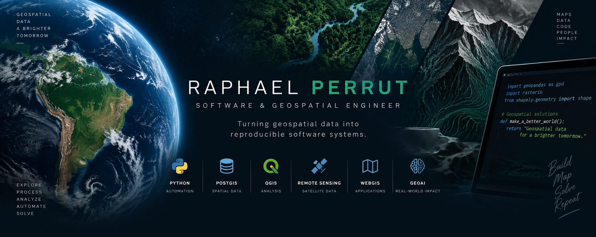

  

  <strong>Geospatial Software · Spatial Data Engineering · Remote Sensing · WebGIS · GeoAI</strong>

  Building reproducible software systems for complex geospatial problems.

---

## 🧭 What I Build

I combine **geospatial expertise and software engineering** to design tools, pipelines and applications for spatial data processing and analysis.

My main areas of interest include:

- **Geospatial Software Engineering** — GIS automation, spatial processing and geospatial applications
- **Spatial Data Engineering** — ETL pipelines, spatial databases, data validation and transformation
- **Remote Sensing** — satellite imagery, raster processing and terrain analysis
- **Backend Development** — APIs, processing services and geospatial backends
- **WebGIS** — interactive web mapping and spatial applications
- **GeoAI** — computer vision and AI applied to geospatial problems

---

## 🛠️ Tech Stack

### Geospatial

`QGIS` · `GDAL` · `PostGIS` · `GeoPandas` · `Rasterio` · `Shapely` · `PyProj` · `MapLibre`

### Backend & Data

`Python` · `FastAPI` · `PostgreSQL` · `SQLAlchemy` · `Redis` · `Celery`

### Web

`TypeScript` · `React` · `Next.js`

### Infrastructure

`Docker` · `GitHub Actions` · `Linux`

### AI & Computer Vision

`PyTorch` · `OpenCV` · `Image Segmentation` · `GeoAI`

---

## 📌 Featured Projects

### 🧭 [Geo Coordinate Toolkit](https://github.com/raphaelperrut/geo-coordinate-toolkit)

A lightweight Python CLI for coordinate transformation, CRS inspection, vector reprojection, geodesic distance calculation and geometry validation.

Built as a tested and reproducible geospatial software package with a clean separation between core functionality and command-line presentation.

`Python` · `PyProj` · `GeoPandas` · `Shapely` · `Typer` · `pytest` · `GitHub Actions`

**Highlights:** 20 automated tests · Continuous integration · Python 3.12+ · MIT License · [v0.1.0](https://github.com/raphaelperrut/geo-coordinate-toolkit/releases/tag/v0.1.0)

---

### 🗺️ [Map Georeferencer](https://github.com/raphaelperrut/map-georeferencer)

A Python toolkit for georeferencing raster maps and imagery from ground control points, with affine transformation estimation, residual analysis, RMSE calculation and GeoTIFF export.

Built as a reproducible end-to-end raster processing workflow with GCP validation, least-squares transformation estimation, north-up warping and machine-readable accuracy reporting.

`Python` · `NumPy` · `Rasterio` · `PyProj` · `Typer` · `pytest` · `GitHub Actions`

**Highlights:** 34 automated tests · Continuous integration · Reproducible example · JSON accuracy reports · Python 3.12+ · MIT License · [v0.1.0](https://github.com/raphaelperrut/map-georeferencer/releases/tag/v0.1.0)

---

### 🔄 [Geospatial ETL Pipeline](https://github.com/raphaelperrut/geospatial-etl-pipeline)

A reproducible Python ETL pipeline for ingesting, inspecting, validating, normalizing, transforming and loading heterogeneous geospatial vector datasets into PostgreSQL/PostGIS.

Built around explicit and independently testable ETL stages, with CRS transformation, schema normalization, Docker-backed PostGIS integration and machine-readable execution reports.

`Python` · `GeoPandas` · `PostGIS` · `PostgreSQL` · `SQLAlchemy` · `GeoAlchemy2` · `Typer` · `Docker` · `pytest` · `GitHub Actions`

**Highlights:** 37 automated tests · Real PostGIS integration · End-to-end GeoPackage → PostGIS validation · Docker Compose · JSON ETL reports · Continuous integration · Python 3.12+ · MIT License · [v0.1.0](https://github.com/raphaelperrut/geospatial-etl-pipeline/releases/tag/v0.1.0)

---

## 🚧 Projects in Development

### 🌊 DEM Hydrology Pipeline

Automated terrain and hydrological processing from DEM data, including flow analysis, stream extraction and vector network generation.

`Python` · `WhiteboxTools` · `Rasterio` · `GDAL` · `GeoPandas`

---

### 🌐 Spatial API

A spatial backend for querying and processing geospatial data through REST APIs backed by PostGIS.

`FastAPI` · `PostgreSQL` · `PostGIS` · `SQLAlchemy` · `Docker`

---

### 🗺️ WebGIS

Interactive web mapping applications connecting spatial databases, APIs and modern web mapping technologies.

`MapLibre` · `React` · `Next.js` · `FastAPI` · `PostGIS`

---

### 🛰️ Satellite Change Detection

A reproducible workflow for detecting and analyzing changes from multi-temporal satellite imagery.

`Python` · `Rasterio` · `GeoPandas` · `OpenCV` · `Remote Sensing`

---

## 🚀 Current Focus

I'm currently expanding this portfolio through progressively more complete geospatial software systems, with emphasis on:

- DEM and hydrological processing
- Spatial APIs and PostGIS-backed services
- Satellite imagery processing
- WebGIS architecture
- GeoAI and computer vision
- Reproducible geospatial workflows
- Open-source software engineering

---

## 🤝 Open to Collaboration

I'm open to selected freelance, open-source and collaborative projects involving:

- Geospatial software development
- Python automation
- GIS workflow automation
- PostGIS and spatial databases
- Remote sensing and satellite imagery
- Spatial data pipelines
- WebGIS
- GeoAI
- Open-source development and bounties

---

## 📫 Connect

I'm expanding my public portfolio through tested, documented and reproducible open-source geospatial software.

- **GitHub:** [github.com/raphaelperrut](https://github.com/raphaelperrut)
- **LinkedIn:** Coming soon
- **Portfolio:** Coming soon

---

  <em>Turning geospatial data into reproducible software systems.</em>

